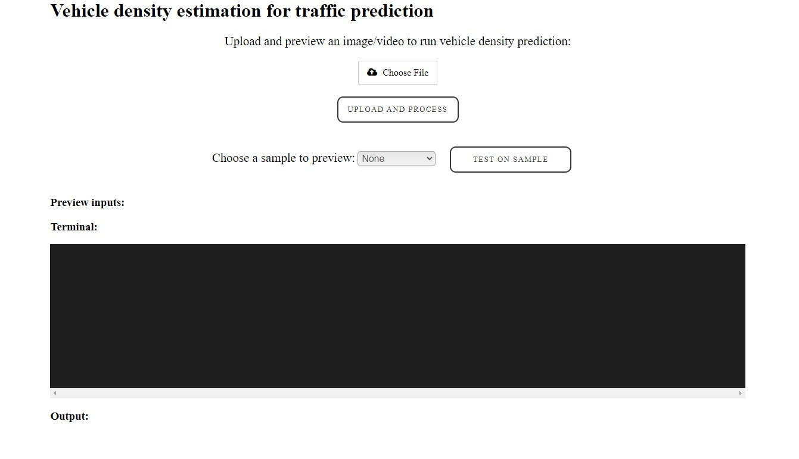
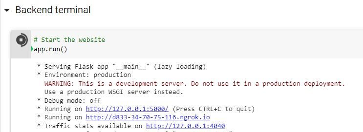

## Vehicle density estimation for traffic prediction using YOLOv4

       

&nbsp;

## Front page
 

&nbsp;

## 📙 About
- Detect vehicle object using a trained YOLOv4 model.
- Estimates the density of the traffic given a image or video.
- Application able to host and deploy within minutes.
- Great scalability and performance with the help of Google Colab powerful resources.

**Google Colab link**: https://colab.research.google.com/drive/1orMfA9sJtbQDDMwW2ZLjQfIY2Vt2hPBq?usp=sharing

&nbsp;

## ▶️ How to run/host
1. Open the link to the google colab 
2. Make a copy of the google colab file
3. Check that you have enabled GPU  
> (Runtime -> Change runtime type -> Hardware Accelerator = Gpu )
4. Then, run all the lines (Takes about 3min)
> (Runtime -> Run all) or Ctrl + F9
5. At the very end click the second link in the output (Ends with ngrok.io)
 
6. 🎉 Congratulations you have succesfully hosted the application.

## Sample test results
 
> Original video link: https://www.youtube.com/watch?v=PSf09R3D7Lo&ab_channel=PanasonicSecurity

